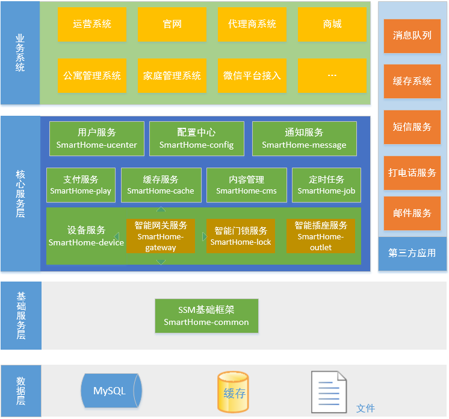

# SamrtHome
智能家居服务器
## 项目介绍

　　基于Spring+SpringMVC+Mybatis分布式敏捷开发系统架构，实现多服务模块：设备管理、内容管理、支付中心、用户管理（包括第三方）、微信平台、存储系统、配置中心、日志分析、任务和通知等，支持服务治理。

#### 架构图

#### 模块介绍

> smarthome-common

Spring+SpringMVC+Mybatis框架集成公共模块，包括业务异常基类、工具类等。

> smarthome-common-config

公共配置，包括zookeeper注册中心地址及服务的协议端口，RabbitMQ配置和JDBC配置。

> smarthome-common-entity

通用实体类和枚举类

> smarthome-common-service

通用核心服务和DAO基类

> smarthome-service-home

智能家庭服务

> smarthome-service-device

智能设备基础服务

> smarthome-service-gateway

智能网关设备服务

> smarthome-service-lock

智能门锁设备服务

> smarthome-service-message

消息通知消费服务

> smarthome-service-rabbitmq

消息通知生产者服务

> smarthome-cms

内容管理系统：支持多标签、多类目、强大评论的内容管理，有基本单页展示，菜单管理，系统设置等功能。

> smarthome-pay

- 一站式支付解决方案，统一下单接口，支持支付宝、微信、网银等多种支付方式。不涉及业务的纯粹的支付平台。

> smarthome-ucenter

通用用户管理系统， 实现最常用的用户注册、登录、资料管理、个人中心、第三方登录等基本需求，支持扩展二次开发。

> smarthome-wechat

微信公众号管理平台，实现官网后台自动回复、菜单管理、素材管理、用户管理、消息群发等基础功能。

> smarthome-shop

电子商务系统

### 技术选型

#### 后端技术:
技术 | 名称 | 官网
----|------|----
Spring Framework | 容器  | [http://projects.spring.io/spring-framework/](http://projects.spring.io/spring-framework/)
SpringMVC | MVC框架  | [http://docs.spring.io/spring/docs/current/spring-framework-reference/htmlsingle/#mvc](http://docs.spring.io/spring/docs/current/spring-framework-reference/htmlsingle/#mvc)
Apache Shiro | 安全框架  | [http://shiro.apache.org/](http://shiro.apache.org/)
MyBatis | ORM框架  | [http://www.mybatis.org/mybatis-3/zh/index.html](http://www.mybatis.org/mybatis-3/zh/index.html)
MyBatis Generator | 代码生成  | [http://www.mybatis.org/generator/index.html](http://www.mybatis.org/generator/index.html)
PageHelper | MyBatis物理分页插件  | [http://git.oschina.net/free/Mybatis_PageHelper](http://git.oschina.net/free/Mybatis_PageHelper)
Druid | 数据库连接池  | [https://github.com/alibaba/druid](https://github.com/alibaba/druid)
ZooKeeper | 分布式协调服务  | [http://zookeeper.apache.org/](http://zookeeper.apache.org/)
Dubbo | 分布式服务框架  | [http://dubbo.io/](http://dubbo.io/)
Redis | 分布式缓存数据库  | [https://redis.io/](https://redis.io/)
Quartz | 作业调度框架  | [http://www.quartz-scheduler.org/](http://www.quartz-scheduler.org/)
Ehcache | 进程内缓存框架  | [http://www.ehcache.org/](http://www.ehcache.org/)
RabbitMQ | 消息队列  | [http://www.rabbitmq.com/](http://www.rabbitmq.com/)
Maven | 项目构建管理  | [http://maven.apache.org/](http://maven.apache.org/)
